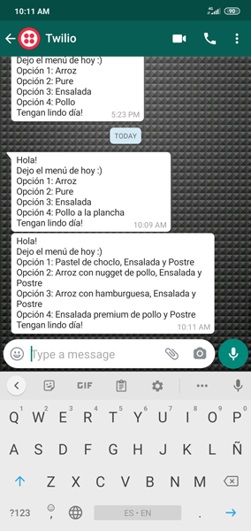
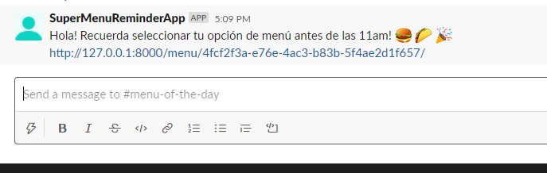
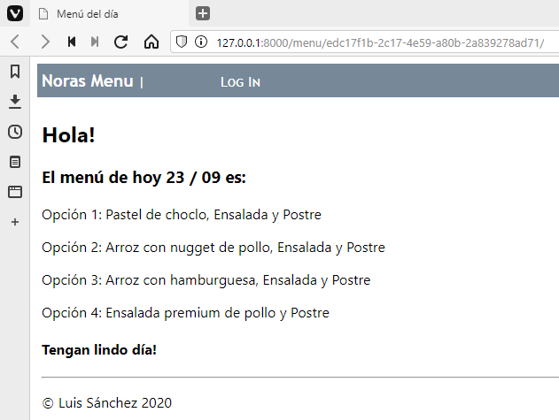

## New Nora's Menu

### About

Nora's Menu is a simple application that consist of a person sending a text message via Whatsapp to all the chilean employees, the message contains today's menu with the different alternatives for lunch, for example:

> Hola!  
> Dejo el menú de hoy :)
>
> Opción 1: Pastel de choclo, Ensalada y Postre  
> Opción 2. Arroz con nugget de pollo, Ensalada y Postre  
> Opción 3: Arroz con hamburguesa, Ensalada y Postre  
> Opción 4: Ensalada premium de pollo y Postre
>
> Tengan lindo día!

Aditionally Nora can:

- Create a menu for a specific date.
- Send a Slack reminder with today's menu to all chilean employees (this process needs to be asynchronous, but can also be trigger on the site).

The employees should be able to:

- Choose their preferred meal (until 11 AM CLT).
- Specify customizations (e.g. no tomatoes in the salad).

Nora is the only user to be able to see what the employees have requested and to create and edit today's menu.

The employees should be able to specify what they want for lunch but they shouldn't be able to see what others have requested.

NOTE: The slack reminders must contain an URL to today's menu with the following pattern https://nora.awesome.menu.palta.io/menu/xxxxxxxx-xxxx-xxxx-xxxx-xxxxxxxxxxxx, this page is for anonymous users.

## What's new on this version?

- Nora can send whatsapp messages manually on the admin page.`

  

- Slack messages to the channel can also be send manually (they are also scheduled to be sent every week day at 9:30am).

  

  

### Validations

- Employees cannot send a menu after 11:00 am and cannot send two menus on the same day.
- Nora only can edit a menu of the same day. Editions of future menues are not allowed.
- Nora has a new admin for testing purposes: a new hability to add 5 dummy users, but be aware, these employees don't have phone number.
- Nora has a new form where phone numbers can be added to employees (so the whatsapp message can be delivered).

## How to install locally

1. Open your terminal and type:

```
git clone https://github.com/LuisSanchez/Backend-Test-Sanchez.git
```

2. Install the requirements:

```
pip install -r requirements.txt
```

3. Run the migrations:

```
python manage.py migrate
```

4. Add the following variables to your environment:

```
SECRET_KEY_MENU="Your App Key"

TWILIO_ACCOUNT_SID="Your App Key"
TWILIO_AUTH_TOKEN="Your App Key"
TWILIO_FROM_WHATSAPP="whatsapp:+your sandbox from number"
TWILIO_TO_WHATSAPP="whatsapp:+your number"

SLACK_TOKEN="Your Token"
SLACK_CHANNEL="Your Slack Channel"

CELERY_BROKER_URL='pyamqp://'

BASE_URL_SERVER='http://127.0.0.1:8000'
```

5. Create your Nora Super Admin:

```
python manage.py createsuperuser --username=nora --email=nora@palta.domain.com
```

6. Run your application:

```
python manage.py runserver
```

## Aditional features

- If Nora updates the menu, an automatic new message is sent via whatsapp to the employees.
- The image for the project is on my [docker-hub](https://hub.docker.com/r/luissanchezm86/nora-awesome-menu)
- Docker-compose with RabbitMQ is added. To run it just run the following command on the console:

```
docker-compose up
```

